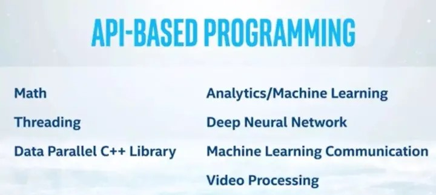

# OneAPI：天下大同

OneAPI是英特尔在生态布局中最重要的一环，这已经不是什么秘密了。早在2018年底举行的英特尔架构日上，英特尔的芯片首席架构师Raja Koduri就对外公布了公司正在着力研发的一件“大事”：一个名为OneAPI的软件编程框架。

**OneAPI：梦想照进现实？**

顾名思义，**OneAPI旨在提供一个适用于各类计算架构的统一编程模型和应用程序接口**。也就是说，应用程序的开发者只需要开发一次代码，就可以让代码在跨平台的异构系统上执行，底层的硬件架构可以是CPU、GPU、FPGA、神经网络处理器，或者其他针对不同应用的硬件加速器等等。

**OneAPI的口号是“No transistor left behind”**，可以翻译成“晶体管一个也不能少”，这很形象的总结了OneAPI的终极目标。

很多人在看到OneAPI之后的第一反应，都是三个字：不可能。有些略显极端的媒体甚至认为，OneAPI已经超出科幻小说的范畴，实在难以置信。

这些怀疑的声音并非毫无依据，应用程序的跨平台优化一直是业界研究的热点和重点之一。而OneAPI希望一次性解决四个硬件架构的异构编程问题，无异于在游戏开始就选择了地狱难度。

## 梦想还是要有的，万一实现了呢？

对于大多数应用程序的开发者来说，使用高级语言编程已经成为了再平常不过的事情。试想一下，你上一次写C++或Python、并需要知道特定处理器指令的操作码是什么时候？

事实上，**现有的高级语言编译器已经很好的将程序开发与底层的计算机体系结构分离开来**。这使得应用程序开发者可以专注于算法和应用的开发，而无需关心太多底层的CPU究竟如何实现程序。

然而，随着应用的复杂性不断增加，对算力的要求也逐渐加大。此时，单纯依靠堆积CPU内核已经无法满足应用程序对于性能、实时性、功耗、成本等等的要求。人们开始使用越来越多的非CPU计算单元，比如GPU、FPGA、以及各种针对不同应用而开发的专用芯片等。这些硬件加速器与CPU一起组成了复杂的异构平台。

为了发挥这个异构平台的最大性能，开发者需要深入了解底层硬件的体系结构，以及一系列的特定开发手段和技巧，以便针对性的利用各个异构单元的优势。

拿FPGA来说，如果按开发软件的思路去开发FPGA硬件，比如使用了各种循环嵌套、多层条件分支等等，恐怕只会得到一个连时序都无法收敛的FPGA设计。同样的，如果想用GPU做一些加速运算，那么最好在团队中有人对CUDA或OpenCL等有丰富的经验，否则就有可能白白消耗了GPU的高功耗而收效甚微。

这里只有一个问题：**对于普通的软件工程师或算法工程师而言，了解和掌握这些硬件相关的开发知识几乎是不可能的**。

而这正是OneAPI希望解决的痛点（引自英特尔）：

> “OneAPI 提供一个通用、开放的编程体验，让开发者可以自由选择架构，无需在性能上作出妥协，也大大降低了使用不同的代码库、编程语言、编程工具和工作流程所带来的复杂性”。

## OneAPI：HLS的进化形态？

具体来说，**英特尔将旗下的芯片架构分成了SVMS四类**，即：

- 标量（Scalar）：CPU
- 矢量（Vector）：GPU
- 矩阵（Matrix）：AI芯片
- 空间（Special）：FPGA

这四类架构分别有各自的优势和适用范围，同时也有着各自的编程模型和方法。

以FPGA为例，FPGA的硬件可编程性一直是它最主要的特点，也是与其他硬件加速器相区分的重要特性。然而，对FPGA进行编程远远没有听起来那么简单，这在老石之前的文章中也详细介绍过多次。**其中最大的难点，就是要使用硬件描述语言（HDL）对电路行为进行建模，而且这种建模往往有着比较低的抽象程度**。

也就是说，FPGA开发者需要将待实现的算法进行分解、并行化、设计流水线，使其成为一个个数据通路或控制电路，同时还要设计数据的存储和读取方式、各种时钟域的同步、进行时序收敛等诸多优化，以符合系统的功耗、吞吐量、精度、面积等需求。这还不包括电路仿真、调试，以及在软件层面需要做的一系列工作。

这样，为了做出一个真正优化过的FPGA设计，往往需要一个有着丰富设计经验的团队协同合作。而就算有这样的团队，**在处理一个再常见不过的for循环嵌套时，都可能花费长达数月的时间进行FPGA的硬件实现与性能调优**。只需要看一下过去几年里，各类国际顶会和期刊上有多少关于FPGA循环展开与优化的论文就可见一斑了。

为了应对FPGA的设计复杂度过大的问题，业界通常有两种方法：第一，尽量将优化过的硬件设计封装成IP，让使用者直接调用。第二，使用诸如高层次综合（HLS）的方法，直接将高层语言描述的模型转化为FPGA硬件。

HLS（High-Level Synthesis，高级综合）一直以来都是FPGA（Field-Programmable Gate Array，现场可编程门阵列）行业发展的重要方向之一。HLS是一种将高级语言（如C、C++）或硬件描述语言（如SystemVerilog、VHDL）转换为硬件描述的自动化技术。通过使用HLS工具，开发人员可以在高层次的抽象上描述硬件功能，并自动生成对应的硬件描述，从而极大地提高了硬件开发的效率。

相比传统的手工RTL（Register Transfer Level，寄存器传输级）设计方法，HLS具有许多优势。首先，使用高级语言进行开发可以提供更高的抽象级别，使得硬件设计变得更容易理解和维护。其次，HLS可以自动执行综合、优化和布局布线等任务，减少了开发人员在底层细节上的工作量。此外，HLS还提供了快速迭代设计的能力，开发人员可以通过修改高级代码来快速验证和优化设计。

HLS的发展对于FPGA行业具有重要意义。它使得更多的开发人员能够利用其在软件领域的经验和技能来进行硬件开发，从而扩大了FPGA的用户群体。此外，HLS还有助于缩短产品的上市时间，提高了产品开发的效率和灵活性。

然而，**HLS的主要问题是，它设计的初衷是为了硬件工程师服务，而非软件和算法开发者**。因此，起码到目前为止，在业界取得成功的HLS工具都需要使用者有着丰富的硬件知识。在数字电路工程师手中，HLS工具已经被证明可以极大的缩短设计周期，有时甚至可以得到近似或优于人工优化过的RTL代码。然而对于软件工程师，**HLS就好比让C罗去湖人队打篮球，固然噱头十足，但很难得到令人满意的成绩**。

OneAPI在很大程度上可以看做是HLS的扩展，但**它的主要目标受众则是软件和算法工程师，这也将成为OneAPI与其他HLS工具的最主要区别**。OneAPI提供了一个统一的软件编程接口，使得开发者可以随意在底层硬件之间进行切换和优化，而无需太多关心具体的电路结构和细节。

## DPC++语言与硬件加速库

具体来说，**OneAPI的核心是一个名为Data Parallel C++（DPC++）的编程语言**。DPC++本质上是C++的扩展，增加了对SYCL的支持。

SYCL由Khronos组织开发，它是一个在OpenCL上的C++抽象层，使得用户可以直接用简洁的C++对GPU等进行开发，而无需被OpenCL限制。

不过，有关DPC++本身的资料目前还比较有限，尚不清楚其具体的开发方法、以及如何对异构系统进行编程。待具体实例出现后，老石再进行详细解读。


除了编程接口外，OneAPI还会包含一个完整的开发环境、软件库、驱动程序、调试工具等要素，并且这些加速库都已经针对底层硬件进行了优化设计。

**这种基于优化过的加速库的设计，和赛灵思的Vitis系统有着异曲同工之妙，而这也恰恰代表了业界发展的方向**。现如今，生态为王，为了掌握生态和开发者，就必须尽可能多的提供各类开发库和IP，以便开发者专注于应用开发，而无需重复造轮子。



(图片来自英特尔)

为了支持SVMS四大类硬件架构，OneAPI实际上给自己设置了非常高的目标。英特尔已经在2019年四季度发布了OneAPI的开发者测试版。除了基本工开发工具包之外，英特尔还发布了**针对高性能计算（HPC）、深度学习、IoT、以及视觉和视频等四种领域专用的开发工具包**，以期为这些特定的应用进行针对性的优化。在当前的版本中，开发者仍然需要在SVMS四大类中手动指定目标器件类别。但除此之外，OneAPI就会自动对目标器件的子类别进行优化。

## 如何使用OneAPI？

- 安装英特尔 oneAPI：首先下载并安装英特尔 oneAPI 基础工具包，其中包括开发机器学习应用程序所需的工具和库。
- Choose a Programming Language：选择oneAPI支持的编程语言，如C++、Fortran、Data Parallel C++ (DPC++)。 建议将 DPC++ 用于机器学习工作负载，因为它为异构架构提供了现代且高效的编程模型。
- 熟悉库：Intel oneAPI 提供了几个对机器学习有用的库，例如oneDNN（oneAPI 深度神经网络库）和oneDAL（oneAPI 数据分析库）。 这些库提供了常见机器学习算法和函数的优化实现。
- 设计你的机器学习模型：定义你的机器学习模型的架构和结构。 确定要构建的模型类型，例如神经网络、决策树或支持向量机。
- 实施模型：使用选定的编程语言和 oneAPI 库来实施您的机器学习模型。 利用库提供的功能来加载数据、预处理数据、训练模型并进行预测。
- 优化性能：利用 oneAPI 提供的性能优化功能。 使用矢量化和多线程等并行化技术来加速计算。 此外，如果可用，请考虑使用 GPU 或 FPGA 等硬件加速器。
- 测试和评估：通过在不同的数据集上进行测试来验证您的机器学习模型。 使用与您的问题相关的指标评估其性能，例如准确度、精确度、召回率或 F1 分数。
- 部署和扩展：开发和测试机器学习模型后，请考虑将其部署到生产环境中。 您可以根据您的特定要求将您的模型部署在 Intel 硬件平台上，例如 CPU、GPU 或 FPGA。

另外，Intel oneAPI 官方文档提供了使用 oneAPI 进行机器学习的详细信息、教程和示例，可以作为参考。

:book:[oneapi_installation-guide-windows_2023.0-766284-766285.pdf](oneapi_installation-guide-windows_2023.0-766284-766285.pdf)  

:book:[Intel®-oneAPI-AI-Analytics-Toolkit-ML-Optimizations - w-o H2H.pdf](Intel®-oneAPI-AI-Analytics-Toolkit-ML-Optimizations - w-o H2H.pdf) 

### 例子：线性回归模型

下面是一个简单示例，说明如何使用英特尔 oneAPI 实施机器学习算法。 我们将使用 DPC++ 编程模型和 oneDNN 库来构建线性回归模型。

```cpp
l.hpp>
#include <oneapi/dnnl.hpp>

namespace sycl = cl::sycl;
namespace dnnl = oneapi::dnnl;

int main() {
    // Create a SYCL queue
    sycl::queue queue(sycl::default_selector{});

    // Define the input data
    const int numSamples = 10;
    const int numFeatures = 1;
    float input[numSamples][numFeatures] = {
        {1.0}, {2.0}, {3.0}, {4.0}, {5.0}, {6.0}, {7.0}, {8.0}, {9.0}, {10.0}
    };
    float target[numSamples] = {2.0, 4.0, 6.0, 8.0, 10.0, 12.0, 14.0, 16.0, 18.0, 20.0};

    // Create the computational graph
    dnnl::engine engine(dnnl::engine::kind::cpu, 0);
    dnnl::stream stream(engine);
    dnnl::memory::dims inputDims = {numSamples, numFeatures};
    dnnl::memory::dims targetDims = {numSamples};
    dnnl::memory::desc inputDesc(inputDims, dnnl::memory::data_type::f32, dnnl::memory::format_tag::ab);
    dnnl::memory::desc targetDesc(targetDims, dnnl::memory::data_type::f32, dnnl::memory::format_tag::a);
    dnnl::memory inputMem(inputDesc, engine);
    dnnl::memory targetMem(targetDesc, engine);
    dnnl::memory::desc outputDesc(targetDims, dnnl::memory::data_type::f32, dnnl::memory::format_tag::a);
    dnnl::memory outputMem(outputDesc, engine);

    // Create the linear regression primitive
    dnnl::inner_product_forward::desc forwardDesc(
        dnnl::prop_kind::forward_training, inputDesc, dnnl::memory::desc(), outputDesc
    );
    dnnl::inner_product_forward::primitive_desc forwardPrimDesc(forwardDesc, engine);
    dnnl::inner_product_forward forward(forwardPrimDesc);

    // Allocate and initialize memory buffers
    float* inputPtr = static_cast<float*>(inputMem.get_data_handle());
    float* targetPtr = static_cast<float*>(targetMem.get_data_handle());
    std::copy_n(&input[0][0], numSamples * numFeatures, inputPtr);
    std::copy_n(&target[0], numSamples, targetPtr);

    // Set up memory arguments for the forward pass
    forwardArgs.set(0, inputMem);
    forwardArgs.set(1, targetMem);
    forwardArgs.set(2, outputMem);

    // Execute the forward pass
    forward.execute(stream, forwardArgs);

    // Retrieve the output
    float* outputPtr = static_cast<float*>(outputMem.get_data_handle());

    // Print the predicted values
    for (int i = 0; i < numSamples; i++) {
        std::cout << "Predicted: " << outputPtr[i] << std::endl;
    }

    return 0;
}
```

在此示例中，我们首先定义由 numSamples 样本和 numFeatures 特征组成的输入数据。 然后，我们创建一个 SYCL 队列来执行计算。 我们使用 oneDNN 库定义计算图，指定输入和输出维度，并创建必要的内存对象。 接下来，我们使用 oneDNN API 创建线性回归原语。

初始化输入和目标数据后，我们通过提供内存参数来执行线性回归原语的前向传递。 最后，我们检索输出值并打印它们。结果为：

```cpp
Predicted: 2.2
Predicted: 4.4
Predicted: 6.6
Predicted: 8.8
Predicted: 11.0
Predicted: 13.2
Predicted: 15.4
Predicted: 17.6
Predicted: 19.8
Predicted: 22.0
```

## **结语**

兵法云，兵马未动，粮草先行。在技术进步日新月异的当代，各类AI芯片、硬件加速器不断涌现，异构计算已经成为整个行业最重要的趋势。针对这些层出不穷的新硬件，则更应该**“架构未动，软件先行”**。作为芯片厂商，单纯提供芯片产品已经无法满足市场和使用者的需要，只有同时提供硬件和软件生态，才能在激烈的竞争中杀出一席之地。

总而言之，OneAPI作为英特尔当前最具战略意义的生态布局，旨在通过统一的编程模型和工具集促进跨英特尔体系结构的软件开发。它将有助于提高开发效率、加强竞争力，并扩大英特尔的开发者生态系统。相信有了诸如OneAPI之类的高层设计工具，软件工程师和算法专家们就能进一步释放包括FPGA在内的异构系统的底层算力。至于OneAPI未来的表现如何，让我们拭目以待。
